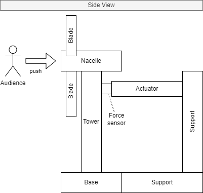
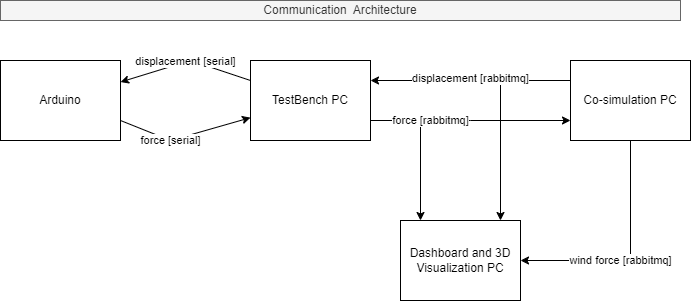
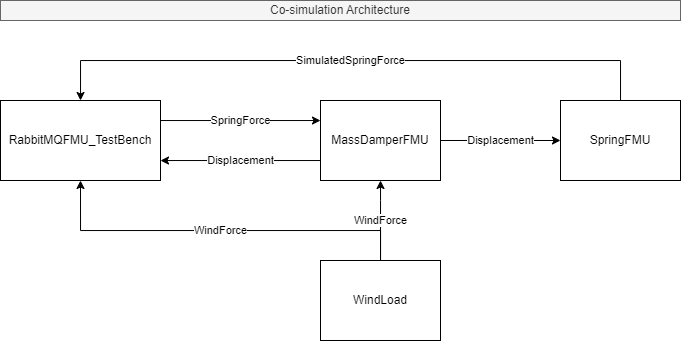

# Example Distributed Co-simulation

Read about the DIGIT-BENCH project [here](https://digit.au.dk/research-projects/digit-bench). The technology was demonstrated on April 24th during the [Aarhus University Festival of Research](https://international.au.dk/about/visitors/festivalofresearch).

This repository shows an example of distributed co-simulation using the following technologies:
- [Docker](https://www.docker.com/): for virtualization
- [RabbitMQ](https://www.rabbitmq.com/): for communication
- [RabbitMQFMU](https://github.com/INTO-CPS-Association/fmu-rabbitmq): bridge between RabbitMQ and co-simulation
- [Unity](https://unity.com/): for visualization
- [Maestro](https://github.com/INTO-CPS-Association/maestro): for co-simulation orchestration
- [InfluxDB](https://www.influxdata.com/): for real-time graphs

### Experiment Setup

The setup of this demo is as follows:

- A testbench consisting of a flexible plastic rod, representing the tower of a wind turbine, with a force-sensing linear actuator joined at its side.  

    \
   *Diagram showing a side view of the testbench.*

- An Arduino, responsible for:
   - Measuring the restoring force from the spring and      transmitting it to the simulation
   
   - Controlling the actuator that moves the piston, which displaces the tower from its starting position

- Up to 4 PC's each responsible for:
   - Communicating with the Arduino
   - Executing the simulation 
   - Running real-time graphs on InfluxDB
   - Executing a live visualization through Unity

*For instructions on running the full setup, with the Arduino included, please contact Cláudio Gomes at claudio.gomes@ece.au.dk.*

 \
*Diagram showing the communication architecture of the demo*

## Co-Simulation Architecture

 \
*Diagram showing the co-simulation architecture of the demo.*

The following FMU's are deployed in the co-simulation:

- **Mass Damper:** Simulating the weight of the tower.

- **Spring:** Providing a restoring force based on the displacement of the tower relative to its resting position, representing how the tower can flex in the wind to avoid breaking. 
- **Wind Load:** Exerting a slowly oscillating force on the tower, causing the tower to sway in the wind.  
- **Controller:** Functioning as a bridge between the co-simulation and the rabbitMQ server which exchanges actuator displacement values and observed force sensor data between the simulated and real-life components of the demo. This is done by utilizing a [Rabbitmq FMU](https://github.com/INTO-CPS-Association/fmu-rabbitmq).  

The Spring FMU is calibrated, such that the FMU and physical spring forces follow each other, with minimal deviation. However, by introducing a disturbance like gently pushing on the tower or rapidly heating up the tower, the two the simulated and observed spring forces begin to diverge. 

## Setting Up the Co-Simulation
Before you begin, ensure you have met the following requirements:

- You have installed the latest version of **Python**.
- You have access to a **command-line interface** (e.g., Command Prompt or Terminal).
- Your have installed [Docker Desktop](https://www.docker.com/products/docker-desktop/). 

**Follow these steps to set up the Co-simulation:**

1. Open a terminal in this repo's root folder and run the following command to start all services: \
 `docker-compose up`

   *The first time this is run, docker will pull and build all the required Docker images.
   You can delete these images in your Docker desktop management interface later to recover disk space.*
2. Create a Virtual Environment for Python: \
   `python -m venv venv`
3. Activate the Virtual Environment (Windows): \
   `venv\Scripts\activate`
4. Install Dependency: \
   `pip install pika`

Now you are ready to run the simulation.

## Running the Co-Simulation

1. Make sure the required containers are running. If not, start them using: \
   `docker compose up`
2. Navigate to the Distributed Control Python Directory: \
   `cd distributed_ctrl_python`
3. Run the Control Script: \
   `python3 control.py`
4. Open a New Terminal and Navigate to the Distributed Oneway Directory: \
   `cd distributed_oneway`
5. Run the Maestro Jar Command: \
   `java -jar maestro.jar import Sg1 -output=results -v --interpret ./scenario.json`

   *You should see an output of `"SIM time to REAL time - windows`" in the terminal.*
8.  Wait for the simulation to terminate on its own or `crtl+c` to end it prematurely.
9.  Exit all the terminals and run `docker compose down` to stop all containers.

### Fix for missing dependencies on windows
Missing dll's causes `rabbitmq.dll java.lang.Exception: Load failed!!!` or `EnterInitializationMode failed` error when executing the co-sim. 

To fix it, add the full path of the "fmus\missing_dlls" directory to your "path" user-environment-variables. 

## Real-time Graphs Using Influx DB
This section explain how to add real-time graphs to the co-simulation.

1. Uncomment the telegraf and Influx DB sections from the `docker-compose.yml` file, found in the root folder of this repo.
2. Restart all containers: \
   `docker compose restart` \
   *The Telegraf container should exit with code 1.*

3. Go to http://localhost:8086/ on your browser
4. Setup telegraf:
   - create a new user
   - organisation: DIGIT-BENCH
   - Bucket: FESTIVAL_DEMO

   - Chose Advanced configuration:
      - Configure new telegraf configuration, chose the FESTIVAL_DEMO bucket.
   - Search for and chose the AMQP Consumer plugin and click save and test. 
   - Copy the telegraf API token *(long string ending with `==`)*
   - Create a new system variable *(in the windows environment variables)* called `INFLUX_TOKEN` with the API token as the value. *Remember to put the string in brackets*. 
   
      Alternatively, replace `$INFLUX_TOKEN` with the generated token, in the `telegraf.conf` file.

5. run control.py and execute the cosim as normal.
6. Go to the InfluxDB dashboard and set-up your graphs

## Real-time 3D Visualizations
This section explains how to add Real-time 3D visualizations to the co-simulation.

The visualization has been built into an executable file, so there is no need to install any dependencies.

1. Download the executable file from this [link](https://filesender.deic.dk/?s=download&token=27ea8928-05aa-4801-9550-2b129450e029).
2. Extract the contents of the zip file.
3. Run the executable file.
   * You may get a warning that the file is from an unknown publisher. Click on "More info" and then "Run anyway".
4. The visualization will open in full screen, and wait for RabbitMQ messages.

### Using Amazon Web Services
If you do not wish to use the local Rabbitmq server provided in [rabbitmqserver](rabbitmqserver), contact Claudio Gomes <claudio.gomes@ece.au.dk> for access to RabbitMQ on AWS.
